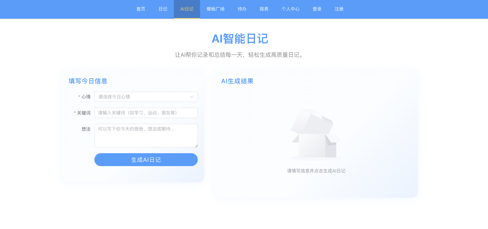

# 智能时光绘（TimeCanvas）

**智能时光绘** 是一个基于AI的智能日记与生活管理系统，帮助你轻松记录生活、生成日记、管理待办、分析财务，并通过丰富的模板和AI能力提升写作与生活效率。

---

## 项目简介

- 一句话生成完整日记，AI自动润色

- 自动分析日记，生成日报/周报/月报
- 日记内容智能提取待办事项
- 自动识别日记中的收支，生成财务报表
- 丰富的日记模板广场，支持个性化选择
- 支持用户注册、登录、个人中心管理


---

## 技术栈

- **前端**：Vue 3 + TypeScript + Element Plus + Pinia + Vue Router + Vite + Axios
- **后端**：Spring Boot 3 + MyBatis-Plus + JPA + Spring Security + JWT + Redis + MySQL
- **AI集成**：LangChain4j、DeepSeek、火山引擎等主流大模型

---

## 目录结构

```
TimeCanvas/
├── TimeCanvas_backend/         # 后端（Java Spring Boot）
│   ├── ApiModule/             # API接口模块
│   ├── ServiceModule/         # 业务与数据层
│   └── UtilModule/            # 工具与通用模块
└── TimeCanvas_frontend/       # 前端（Vue3项目）
```

---

## 核心功能

- **AI日记生成**：一句话描述，AI帮你写出完整日记
- **模板广场**：多种风格模板，支持个性化选择
- **用户认证**：注册、登录、token鉴权
- **待办管理**：AI自动提取日记中的待办事项
- **报表分析**：自动生成日报、周报、月报
- **财务统计**：日记中自动识别收支，生成财务报表
- **个人中心**：管理个人信息、密码、历史记录

---

## 开发环境要求

- JDK 17+
- Maven 3.6+
- MySQL 8.0+
- Redis 6.0+
- Node.js 18+
- 推荐IDE：IntelliJ IDEA / VSCode

---

## 快速启动

### 1. 数据库配置

1. 创建数据库：
```sql
CREATE DATABASE timecanvas_db CHARACTER SET utf8mb4 COLLATE utf8mb4_unicode_ci;
```
2. 修改 `TimeCanvas_backend/ApiModule/src/main/resources/application.yml` 中的数据库账号密码。

### 2. 启动后端

```bash
cd TimeCanvas_backend
mvn spring-boot:run
```
访问API文档：http://localhost:8080/api/doc.html

### 3. 启动前端

```bash
cd TimeCanvas_frontend
npm install  # 或 pnpm install
npm run dev
```
访问前端页面：http://localhost:5173/

---

## 后端接口对接说明

- 前端通过Axios请求后端接口，所有API路径以`/api`为前缀（如`/api/user/login`）。
- 登录、注册、模板列表、AI日记等均有对应接口，详见后端API文档（Knife4j）。
- 需要认证的接口，前端会自动携带token。
- 常用接口：
  - `POST /api/user/login` 用户登录
  - `POST /api/user/register` 用户注册
  - `POST /api/template/list` 获取模板列表
  - `POST /api/diary/create` AI生成日记

---

## 常见问题与排查

- **接口404/跨域**：请确保前后端端口、代理和CORS配置正确。
- **token失效**：重新登录获取新token。
- **数据库无数据**：请先在模板表等插入测试数据。
- **AI接口不可用**：请检查AI服务API Key配置。

---

## 贡献与反馈

欢迎任何建议和贡献！
1. Fork本项目
2. 新建分支开发功能
3. 提交Pull Request

---

## License

Apache 2.0

---

> 本项目由王亮开发，致力于用AI提升每个人的生活记录与管理体验。 